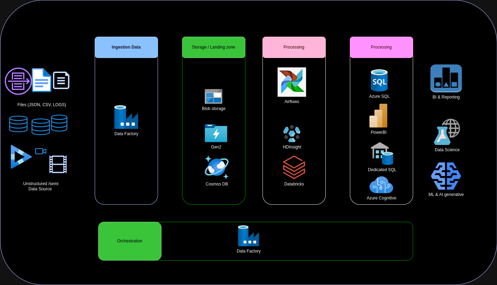

# Batch processing solution Azure Synapse analytics

This architecture illustrates the ingestion, storage, processing, and orchestration of data using various Azure services. It supports use cases such as business intelligence (BI), data science, and machine learning (ML).

## Components

### Ingestion Data
- **Data Factory**: A data integration service that allows scalable data movement, transformation, and orchestration of data flows.

### Storage / Landing Zone
- **Blob Storage**: Massively scalable object storage for unstructured data.
- **Gen2**: Azure Data Lake Storage Gen2, a high-performance file storage service for data analytics.
- **Cosmos DB**: Globally distributed, multi-model database service for applications requiring low latency.

### Processing
- **Airflow**: An open-source workflow platform for orchestrating ETL tasks.
- **HDInsight**: A managed service for running Hadoop, Spark, and other clusters.
- **Databricks**: An analytics platform based on Apache Spark for big data processing and machine learning.

### Additional Processing
- **Azure SQL**: Managed relational SQL database service.
- **Power BI**: Business intelligence tool for data visualization and analytics.
- **Dedicated SQL**: Dedicated SQL server for enhanced performance and complete control.
- **Azure Cognitive Services**: A set of ready-to-use AI services for computer vision, natural language processing, etc.

### Orchestration
- **Data Factory**: Also used for orchestrating data pipelines, managing end-to-end data flows.

### Use Cases
- **BI & Reporting**: Business intelligence and analytical reporting.
- **Data Science**: Data analysis and statistical modeling.
- **ML & AI generative**: Machine learning and generative artificial intelligence.

## Diagram

This diagram illustrates how different Azure services interact to ingest, store, process, and analyze data, supporting various use cases like BI, data science, and AI.
