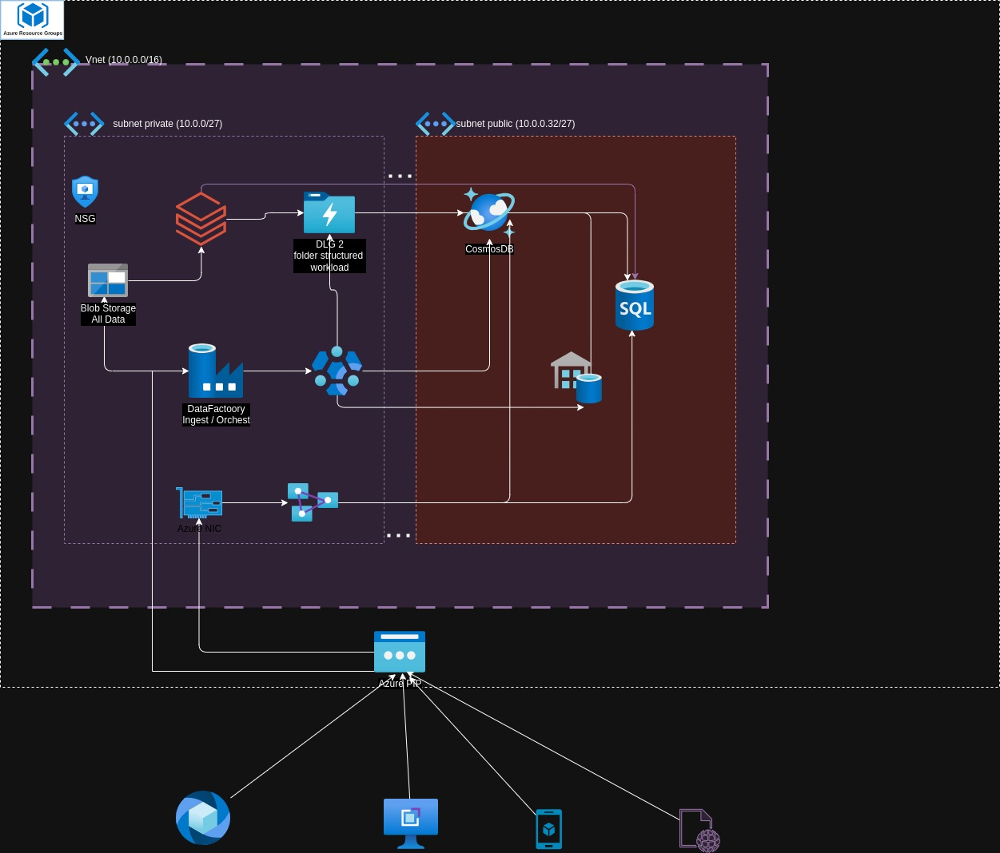

# Azure Data Factory Terraform Setup

This repository contains a Terraform configuration for setting up an Azure Data Factory with linked services, datasets, and pipelines. The setup includes basic resources like resource groups and more advanced configurations like Kafka and Blob storage integrations.

## Architecture Diagram



The architecture diagram above illustrates the setup of the Azure Data Factory along with its components, including Blob Storage, Cosmos DB, SQL Database, and more.

## Project Structure

```
├── main.tf                 # Main Terraform config
├── variables.tf            # Variables file
├── outputs.tf              # Outputs file
├── providers.tf 
├── README.md               # Project README file
└── .gitignore              # Git ignore file
```

## Resources Created

### Resource Group

A resource group to contain all resources.

```hcl
resource "azurerm_resource_group" "rg" {
  name     = var.resource_group_name
  location = var.location
}
```

### Data Factory

The main Data Factory resource.

```hcl
resource "azurerm_data_factory" "adf" {
  name                = "my-data-factory"
  location            = azurerm_resource_group.rg.location
  resource_group_name = azurerm_resource_group.rg.name
}
```

### Linked Service

An example linked service, typically used to connect Data Factory to other services.

```hcl
resource "azurerm_data_factory_linked_service" "storage_linked_service" {
  name              = var.linked_service_name
  data_factory_id   = azurerm_data_factory.adf.id
  connection_string = var.linked_service_connection_string
}
```

### Datasets

Two datasets are defined, one for the source and one for the sink.

#### Source Dataset (Azure Blob Storage Example)

```hcl
resource "azurerm_data_factory_dataset" "source_dataset" {
  name                = var.source_dataset_name
  data_factory_id     = azurerm_data_factory.adf.id
  folder_path         = format("abfs://%s@%s.dfs.core.windows.net/container", var.storage_account_name, var.storage_account_name)
  type                = "Blobstore"
  linked_service_name = azurerm_data_factory_linked_service.storage_linked_service.name
}
```

#### Sink Dataset

```hcl
resource "azurerm_data_factory_dataset" "sink_dataset" {
  name            = var.sink_dataset_name
  data_factory_id = azurerm_data_factory.adf.id
}
```

### Pipeline

A pipeline with a copy activity.

```hcl
resource "azurerm_data_factory_pipeline" "copy_pipeline" {
  name            = var.pipeline_name
  data_factory_id = azurerm_data_factory.adf.id
  is_active       = true

  activity {
    name = "Copy Data"
    type = "Copy"
    inputs = {
      source = azurerm_data_factory_dataset.source_dataset.name
    }
    outputs = {
      sink = azurerm_data_factory_dataset.sink_dataset.name
    }
  }
}
```

### Advanced Example: Kafka to Blob

This example includes a Kafka source and a Blob sink in a Data Factory pipeline.

#### Data Factory for Advanced Example

```hcl
resource "azurerm_data_factory" "pipemine" {
  name                = var.datafactory_name
  location            = azurerm_resource_group.rg.location
  resource_group_name = azurerm_resource_group.rg.name
  sku_name            = var.sku_name

  tags = {
    environment = "Production"
  }
}
```

#### Example Pipeline

```hcl
resource "azurerm_data_factory_pipeline" "example_pipeline" {
  name                = "ExamplePipeline"
  data_factory_name   = azurerm_data_factory.pipemine.name
  resource_group_name = azurerm_resource_group.rg.name

  activities {
    name = "KafkaToBlobActivity"

    type = "Copy"

    type_properties {
      source {
        type           = "KafkaSource"
        consumer_group = "myConsumerGroup"
        topic          = "myKafkaTopic"
      }

      sink {
        type = "BlobSink"
      }
    }

    inputs {
      reference_name = "KafkaInputDataset"
    }

    outputs {
      reference_name = "OutputDataset"
    }
  }
}
```

#### Datasets

##### Kafka Dataset

```hcl
resource "azurerm_data_factory_dataset_kafka" "kafka_input_dataset" {
  name                = "KafkaInputDataset"
  data_factory_name   = azurerm_data_factory.pipemine.name
  resource_group_name = azurerm_resource_group.rg.name

  properties {
    event_hub_name        = "event_hub_name"
    service_bus_namespace = "service_bus_namespace"
    consumer_group        = "myConsumerGroup"
  }
}
```

##### Blob Dataset

```hcl
resource "azurerm_data_factory_dataset_blob" "output_dataset" {
  name                = "OutputDataset"
  data_factory_name   = azurerm_data_factory.pipemine.name
  resource_group_name = azurerm_resource_group.rg.name

  linked_service_name = azurerm_data_factory_linked_service_blob_storage.example.name

  folder_path = "output/"
  file_path   = "output_data.csv"

  format {
    type = "TextFormat"
  }
}
```

#### Linked Service for Blob Storage

```hcl
resource "azurerm_data_factory_linked_service_blob_storage" "example" {
  name                = "ExampleBlobStorage"
  data_factory_name   = azurerm_data_factory.pipemine.name
  resource_group_name = azurerm_resource_group.rg.name

  properties {
    account_name   = "storage_account_name"
    container_name = "container_name"
    linked_service_key {
      type           = "AzureKeyVaultSecret"
      secret_name    = "storage_secret_name"
      secret_version = "storage_secret_version"
    }
  }
}
```

## Prerequisites

- Terraform v0.12+
- Azure CLI
- An Azure subscription

## Getting Started

1. **Clone the repository:**

   ```sh
   git clone git@github.com:datalab-api/azure-dataia-tf.git
   cd azure-dataia-tf
   ```

2. **Initialize Terraform:**

   ```sh
   terraform init
   ```

3. **Apply the Terraform configuration:**

   ```sh
   terraform apply
   ```

   You'll be prompted to enter the necessary variables if they are not defined in a `terraform.tfvars` file or through environment variables.

## Variables

Define these variables in a `variables.tf` file or provide them via CLI or a `terraform.tfvars` file.

- `resource_group_name`
- `location`
- `linked_service_name`
- `linked_service_connection_string`
- `source_dataset_name`
- `sink_dataset_name`
- `pipeline_name`
- `datafactory_name`
- `sku_name`
- `storage_account_name`

## Outputs

You can define and use outputs in `outputs.tf` to capture important resource IDs and other information.

## Contributing

Contributions are welcome! Please fork this repository and submit a pull request with your changes. Ensure that your code follows the project's coding standards and includes appropriate tests.

## License

This project is licensed under the MIT License. See the [LICENSE](LICENSE) file for details.
